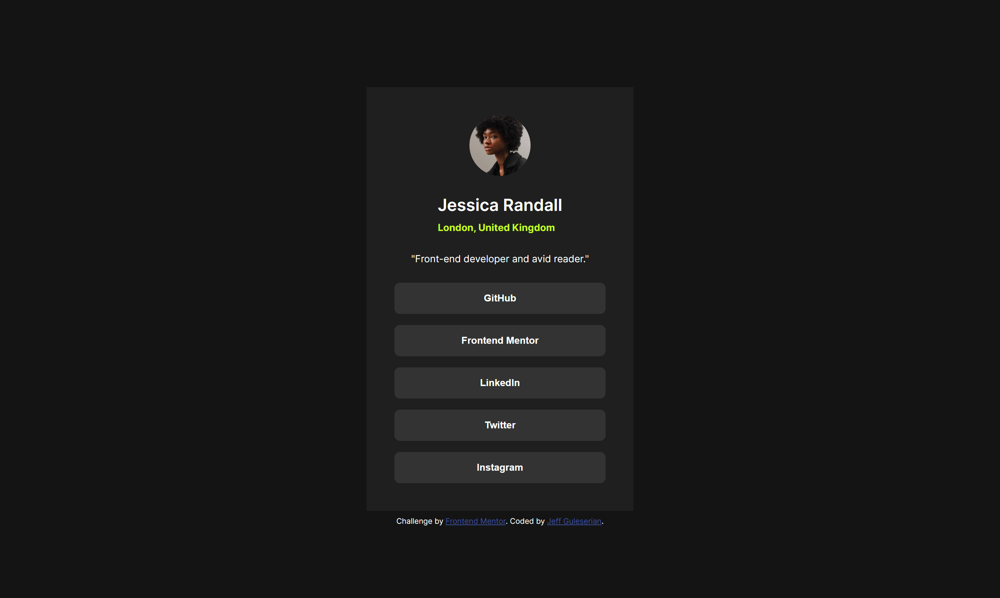

# Frontend Mentor - Social links profile solution

This is a solution to the [Social links profile challenge on Frontend Mentor](https://www.frontendmentor.io/challenges/social-links-profile-UG32l9m6dQ). 

## Table of contents

- [Overview](#overview)
  - [The challenge](#the-challenge)
  - [Screenshot](#screenshot)
  - [Links](#links)
- [My process](#my-process)
  - [Built with](#built-with)
  - [What I learned](#what-i-learned)
  - [Continued development](#continued-development)
- [Author](#author)
- [Acknowledgments](#acknowledgments)

## Overview

### The challenge

**Users should be able to:**

- See hover and focus states for all interactive elements on the page
- Be able to access all links using only the keyboard

**Additional personal challenges:**

- Create focus states for when the user navigates the buttons with the keyboard
- Create active states for mouse clicks
- Created a tab index order for all links but excluded the two links in the footer, since those are only for the point of the exercise
- Make the links "clickable" as actual hyperlinks to open in a new window

### Screenshot

[Click here for the screenshot at 768px](/design/screenshots/screenshot%20768px.png)

[Click here for the screenshot at 375px](/design/screenshots/screenshot%20375px.png)

### Links

- Solution URL: [See my solution on GitHub](https://github.com/jguleserian/FMC-Social-Links-Profile)
- Live Site URL: [Take a look at the site live](https://jguleserian.github.io/FMC-Social-Links-Profile/)

## My process

### Workflow:

1. Set up folders and file structure, set up README.md, create GitHub repo and link it to VS Code 
2. Determine strategy for structuring the page
3. HTML: set major structure with containers, placing the general content within them
4. HTML: starting from the top with each major container, assign content to individual elements and arrange them as necessary.
5. HTML: link and place <picture> and  / <source> files as necessary. Set media query sizes as necessary.
6. CSS: set up.
  - "Pencil in" the major structure using GPS: "reset & variables," "containers," "elements," "classes & ids," "media queries"
  - Write the CSS for the page reset in the ":root," <html>, <body>, and *. I generally put in the variable for colors, font, etc. at this time.
  - Set the media queries, adding in a change of background color so I can visually identify what query I am viewing and to have an element in the query as a placeholder
7. Starting from top to bottom in the HTML, set the CSS styles. 
8. Style/add hover states and animation as necessary
9. Clean up code
10. Test functionality, responsiveness, and similitud with original model in Figma/style guide
11. Upload and publish

### Built with

- Semantic HTML5 markup
- CSS custom properties
- Flexbox
- CSS Grid
- Mobile-first workflow

### What I learned

The purpose of this project was to reinforce skills form the past and try to increase my effeciency and use of time. I felt like that was accomplished. So, in all, this was more of a project of reinforcing old skills, and not developing new ones. 

### Continued development

I enjoyed this project because it provided me an opportunity to practice several skills relating to making the CSS easier by looking for patterns (such as distance between links, padding, etc) and using parent elements to make them consistent. Then, when I use the media query, I only have to change one element instead of multiple. 

## Author

- GitHub - [@jguleserian](https://github.com/jguleserian)
- Frontend Mentor - [@jguleserian](https://www.frontendmentor.io/profile/jguleserian)
- LinkedIn - [@jeffguleserian](https://www.linkedin.com/jeffguleserian)

## Acknowledgments

I want to thank Juan, [@JEWebDev] (https://www.frontendmentor.io/profile/JEWebDev), for his reminders to code effeciently by attempting to create changes in the parent elements to cascade down to the child elements, instead of trying to create changes to each individual child element. Of course, this was just one of his kind suggestions. I appreciate his time and effort in helping me develop this skill and keep it at the forefront of my mind.
